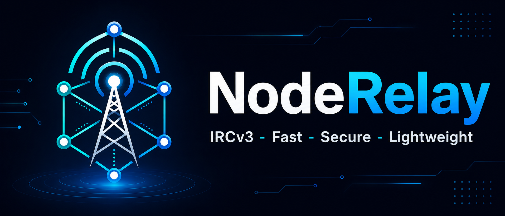
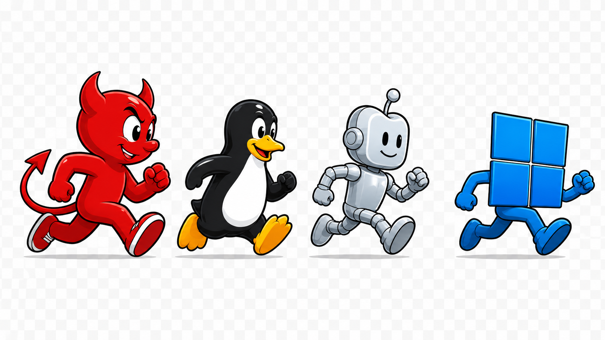

<p align="center">
  
</p>

<p align="center">
  <a href="https://github.com/noderelay/UplinkIRC/releases/latest">
    
  </a>
  <a href="https://github.com/noderelay/UplinkIRC/actions/workflows/ci.yml">
    
  </a>
  <a href="LICENSE">
    
  </a>
  
  
</p>

<p align="center">
  A fast, secure, IRCv3-featured IRC client built with Qt6 and C++.<br/>
  Default network: <strong>irc.linuxdojo.org:6697</strong> &mdash; channel <strong>#uplink</strong>
</p>

---

<p align="center">
  <a href="https://github.com/noderelay/UplinkIRC/releases/latest/download/Uplink-0.25.43-x86_64.AppImage">
    
  </a>
  &nbsp;
  <a href="https://github.com/noderelay/UplinkIRC/releases/latest/download/Uplink-v0.25.43-linux-x86_64.tar.gz">
    
  </a>
  &nbsp;
  <a href="https://github.com/noderelay/UplinkIRC/releases/latest/download/Uplink-v0.25.43-windows-x64.zip">
    
  </a>
  &nbsp;
  <a href="https://github.com/noderelay/UplinkIRC/releases/latest/download/Uplink-v0.25.43-macos-arm64.dmg">
    
  </a>
  &nbsp;
  <a href="#install-dependencies-first">
    
  </a>
</p>

<p align="center">
  <a href="https://uplinkirc.chat/docs/howto.html">
    
  </a>
</p>

<p align="center">
  
</p>

---

## App Icon

<p align="center">
  
  &nbsp;&nbsp;&nbsp;&nbsp;
  
</p>

<p align="center">
  <sub>Dark &nbsp;·&nbsp; Light — choose in <strong>⚙ → App Icon</strong></sub>
</p>

---

## Features

### 🔒 Security & Authentication

| Feature | Details |
|---|---|
| **TLS by default** | All connections via `QSslSocket`. TLS is the default and strongly recommended; plaintext is available via `ssl = false` in config for local/test servers but is not supported or recommended for production use. |
| **TLS certificate verification** | Invalid or self-signed certificates disconnect immediately with an error. No silent bypass. |
| **SASL PLAIN** | Set `sasl_user` + `sasl_password` in config. Full CAP flow: `AUTHENTICATE`, `903`/`904`/`906`. |
| **SASL EXTERNAL** | Certificate-based auth. Set `sasl_external = true`, `client_cert`, and `client_key`. RSA and EC (ECDSA) PEM keys supported. The TLS client cert is presented during the handshake; the server derives your identity from it — no password sent. |
| **DCC Send File** | Right-click any nick → **Send File** (active) or **Send File (Passive)**. Active: sender opens a TCP listener — works when the sender has a reachable port. Passive: receiver opens the port instead — use this when the sender is behind NAT. Standard 4-byte ACK protocol. Both sides get a live progress dialog with cancel. Outgoing filenames are sanitized: control characters are stripped before the filename is embedded in the CTCP message, preventing CTCP injection. |
| **NickServ auto-identify** | Set `nickserv_password` to send `IDENTIFY` on `RPL_WELCOME`. |
| **Credential redaction** | `PASS`, `OPER`, `AUTHENTICATE`, and `NickServ IDENTIFY` payloads are never echoed in the raw log or any visible panel. |
| **OS keychain password storage** | Passwords (`password`, `sasl_password`, `nickserv_password`) are stored in the OS keychain (Secret Service / macOS Keychain / Windows Credential Manager). The config file holds `"<keychain>"` as a sentinel — no plaintext secrets on disk. Existing plaintext passwords migrate automatically on next save. |
| **Config file hardening** | `config.toml` is written with owner-only permissions (mode `0600`). Saves are atomic via `QSaveFile` — a crash mid-save cannot corrupt the file. |
| **Link preview privacy** | Auto-previews skip loopback, RFC 1918 private ranges, link-local, and `.local` addresses. A malicious user cannot cause the client to probe your LAN. |
| **DoS resistance** | Inbound IRC data is capped at 64 KB (oversized streams disconnect). Batch messages cap at 1 000 per batch, 8 open batches maximum. `QTextBrowser` block count is bounded so busy channels cannot grow RAM indefinitely. |
| **CTCP rate limiting** | `VERSION` and `PING` CTCP replies are limited to once per nick per 5 seconds. Reflected `PING` payloads are capped at 32 bytes to prevent amplification. |

### 🌐 IRC Protocol & IRCv3

| Feature | Details |
|---|---|
| **CAP LS 302** | `multi-prefix`, `away-notify`, `server-time`, `message-tags`, `batch`, `chathistory`, `draft/chathistory`, `labeled-response`, `draft/typing`, `echo-message`, `chghost`, `draft/react`, `sasl`, `account-notify`, `account-tag`, `extended-join`, `invite-notify`, `setname`, `userhost-in-names`, `draft/message-redaction`, `sts`, `standard-replies`, `cap-notify`, `draft/metadata-2` |
| **Netsplit / netjoin collapse** | Server-sent `netsplit` and `netjoin` batch types collapse into a single summary line per channel instead of flooding the buffer with individual quit/join lines. |
| **Standard Replies** | `FAIL`, `WARN`, and `NOTE` server commands displayed in the relevant channel or server buffer with clear `[FAIL]`/`[WARN]`/`[NOTE]` prefixes. |
| **STS (Strict Transport Security)** | When a server advertises STS, Uplink upgrades plain connections to TLS automatically and caches the policy to `~/.config/uplink/sts.ini`. Future connections enforce TLS regardless of `ssl` in config. Equivalent to HSTS for IRC. |
| **Chat history replay** | Requests the last 100 messages via `CHATHISTORY LATEST` on join. History messages display dimmed with original timestamps. |
| **Bouncer support** | First-class ZNC and soju: `znc.in/playback`, `soju.im/bouncer-networks`, `soju.im/read`, self-message echo. |
| **mIRC formatting** | Bold, italic, underline, strikethrough, reverse, 16 IRC colors (fg + bg). |
| **CTCP** | Auto-replies to `VERSION` and `PING`. `/ping <nick>` shows round-trip time in channel. `/time <nick>` shows the user's local time in channel. Manual `/ctcp <target> <cmd>` for anything else. |

### 🎨 Interface & Themes

| Feature | Details |
|---|---|
| **306 built-in themes** | 55 hand-picked originals (Catppuccin, Dracula, Nord, Gruvbox, Tokyo Night, Solarized, One Dark, and more) plus all 251 themes from the [base16 catalog](https://github.com/tinted-theming/base16-schemes), named with a `-base16` suffix. Your favorite is almost certainly already in there — browse with arrow keys, apply with Enter. |
| **Reworked Preferences** | Theme as a collapsible list — browse and apply without closing. App icon as radio buttons. Hanging indent toggle and all other UI options. Open with the **⚙ gear icon** in the channel header. |
| **Hanging indent** | Wrapped messages align past the timestamp+nick column. Toggle from **Preferences → Hanging Indent** or `hanging_indent = true` in config. |
| **Hamburger menu** | Click ☰ for About, **Check for Updates** (fetches latest release from GitHub, shows version comparison), **Manage Servers**, Documentation, Open Config (opens `config.toml` in your editor), and Reload Config (restarts the app to apply all config changes). |
| **Channel panes** | Right-click any `#channel` in the sidebar → **Open in Pane**. Up to 4 panes total. Each pane has its own chat history, nick list, topic bar (with toggle), and input bar. Auto-layout: 2 = side by side, 3 = primary left + two stacked right, 4 = 2×2 grid. |
| **Native Windows style** | On Windows, the `windows11` Qt style is used by default. No alien dark theme on fresh installs. Custom themes still available. |
| **Per-widget font sizes** | Independent size control for chat, sidebar, nick list, topic bar, input, and typing indicator. **Preferences → Font Config...** |
| **Panel persistence** | Nick panel width saved on quit, restored on relaunch. |
| **Sidebar toggle** | A close button in the sidebar panel collapses the server/channel list; a reveal button appears at the bottom-left of the chat area to restore it. Width is drag-resizable and persists across sessions. |

### 💬 Chat Features

| Feature | Details |
|---|---|
| **Event condensation** | Consecutive join, part, quit, nick-change, and kick events with no chat message between them collapse into one compact line: `→ nick1 nick2  ← nick3  ~ old→new`. Net-change filter suppresses nicks that both join and part in the same group. Up to 10 nicks shown; overflow shown as `… X more`. |
| **Send button** | Paper-plane button to the right of the emoji button sends the current message — same as pressing Enter. |
| **Emoji picker** | Click 😊 to open a searchable grid of ~400 emoji. Enable with `show_emoji_button = true`. |
| **`:shortcode:` autocomplete** | Type `:fire` and a live completion list appears. Navigate with Up/Down, confirm with Enter. |
| **Emoji auto-substitute** | Typing `:trident:` replaces with 🔱 on the closing colon. Any remaining `:shortcode:` patterns resolve before the message is sent. |
| **Link preview cards** | URLs in messages auto-fetch `og:title` + `og:image`. Dark card with title + domain + thumbnail appears inline. Right-click any link for **Copy URL / Open URL / Hide Preview / Show Preview**. Works with YouTube and other heavy sites via a smart user-agent. Preview background is theme-independent. |
| **Typing indicator** | IRCv3 `draft/typing`. Shows `nick is typing…` as a transparent overlay on the chat background. Sends your own state debounced. |
| **Ignore list** | `/ignore <nick>` suppresses all messages from a nick (PRIVMSG, NOTICE, ACTION). `/unignore <nick>` removes. `/ignored` lists. Right-click → **Ignore / Unignore**. Persists in config. |
| **Reactions** | IRCv3 `draft/react`. Right-click a message timestamp → **React**. Incoming reactions shown inline below the message as emoji + count. `/react <emoji>` with a reply target selected. |
| **Message deletion** | IRCv3 `draft/message-redaction`. Right-click your own message timestamp → **Delete**. Redacted messages show `[message deleted]` in all clients that support it. |
| **Account tracking** | `account-notify` + `extended-join` + `account-tag` + WHOX. NickServ account shown as a tooltip when you hover a nick in the **nick list** or directly on a **nick in the chat view**. Updated in real time on every message (account-tag), on login/logout (account-notify), on join (extended-join), and on channel join via bulk WHO scan. |
| **Watch list (Monitor)** | IRCv3 MONITOR. Use `/monitor add <nick>` to watch for someone coming online. Status changes post to the server buffer. List persists in config. |
| **Per-channel logging** | All messages written to `~/.config/uplink/logs/<server>/<channel>.log`. Toggle in **Preferences → Log Messages to Disk**. |
| **Reply to messages** | Right-click a timestamp → **Reply**. Outgoing message carries `+draft/reply` tag. Received replies show `↩ origNick` inline. |
| **Message search** | **Ctrl+F** opens a search bar. Enter = next match, Shift+Enter = previous, Escape = close. |
| **mIRC colors** | Full IRC color codes rendered in chat. |
| **Tab completion** | Tab-completes nick names and slash commands. Cycles through candidates. |
| **Input history** | Up/Down arrows cycle through sent messages. |

### 🖥️ Nick List & Sidebar

| Feature | Details |
|---|---|
| **Embedded nick panel** | User list sits in a panel on the right side of the chat view. Click the close button in the panel header to collapse it; a reveal button appears at the top-right of the chat area to restore it. Panel width persists across sessions. |
| **Embedded sidebar** | Server/channel list lives inside the same rounded floating card as the chat area and nick list — all three columns share one seamless surface with a matching background. A close button in the sidebar panel collapses it (chat fills the card); a reveal button at the bottom-left restores it. Width is drag-resizable and persists across sessions. |
| **Bot indicators** | Nicks with `+B` mode display 🤖 or 👾 (randomly assigned per nick each session, stable across refreshes). |
| **Colored nicks** | Unique color per nick in both chat and the nick list. Toggle from **☰ → Preferences**. |
| **Prefix sorting** | Nick list sorted by prefix rank: `~ & @ % +` then alphabetical. |
| **Right-click menu** | Full action menu on any nick: **Message**, **Send File**, **Send File (Passive)**, **Whois**, **Invite**, **Give Op**, **Take Op**, **Give Voice**, **Take Voice**, **Version**, **Ping** (CTCP, shows RTT), **Copy Nick**, **Ignore / Unignore** — and for ops: **Kick** (with reason prompt), **Ban** (`nick!*@*`), **Kick & Ban**. |
| **Unread indicators** | A forum icon after the channel name for new activity; a yellow lightbulb icon for nick mentions. Both clear on focus. Your nick is highlighted **red bold** inline in messages that mention you. |

### 🔌 Connectivity & Servers

| Feature | Details |
|---|---|
| **Manage Servers dialog** | Add, edit, remove servers at runtime. Changes take effect immediately, no config edit needed. |
| **Multiple servers** | Connect to as many servers as you want simultaneously. |
| **AppImage (Linux)** | Self-contained single-file executable. Download, `chmod +x`, run. Embeds zsync metadata — update in-place with `appimageupdatetool`. |
| **Auto-reconnect** | Exponential backoff: 5 s → 10 s → 20 s → 40 s → 60 s. Deliberate `/quit` disables it. |
| **Signal bars indicator** | 4-bar stair-step widget in the topic bar. Bar count = ping latency (4 bars < 50 ms … 1 bar > 300 ms). Blue flashing = connecting/reconnecting. Red flashing = disconnected. |
| **System tray** | Minimizes to tray on close (**×** button or **Ctrl+W**). Left-click shows window. Green dot on tray for mention/PM when unfocused; red dot for general unread. |

---

## Quick Start

```bash
git clone https://github.com/noderelay/UplinkIRC.git
cd Uplink
cmake -B build -DCMAKE_BUILD_TYPE=Release
cmake --build build
./build/Uplink
```

On first launch Uplink creates `~/.config/uplink/themes/` and seeds it with all bundled themes automatically.

### Running tests

```bash
cmake -B build -DCMAKE_BUILD_TYPE=Debug
cmake --build build --target tst_ircparser tst_chatformat
ctest --test-dir build
```

Tests cover the IRC message parser (prefix parsing, IRCv3 tags, tag value unescaping, numerics, malformed input) and the chat formatter (HTML escaping, IRC formatting codes, color codes, linkification). Pass `-DUPLINK_BUILD_TESTS=OFF` to CMake to skip them if Qt6 Test is not installed.

### Install dependencies first

<details>
<summary><strong>Arch Linux</strong></summary>

```bash
sudo pacman -S qt6-base qt6-svg cmake tomlplusplus
```
</details>

<details>
<summary><strong>Ubuntu / Debian</strong></summary>

```bash
sudo apt install cmake qt6-base-dev libqt6svg6-dev libtomlplusplus-dev
```
</details>

<details>
<summary><strong>Fedora</strong></summary>

```bash
sudo dnf install cmake qt6-qtbase-devel qt6-qtsvg-devel tomlplusplus-devel
```
</details>

<details>
<summary><strong>FreeBSD</strong></summary>

```bash
sudo pkg install cmake qt6-base qt6-svg tomlplusplus
```
</details>

<details>
<summary><strong>macOS (Homebrew)</strong></summary>

```bash
brew install cmake qt tomlplusplus
```
</details>

---

## Configuration

The config file is created automatically on first launch. You only need to fill in your nickname.

| Platform | Path |
|---|---|
| Linux / FreeBSD | `~/.config/uplink/config.toml` |
| macOS | `~/.config/uplink/config.toml` |
| Windows | `%USERPROFILE%\.config\uplink\config.toml` |

### Minimal example

```toml
[[server]]
host     = "irc.linuxdojo.org"
port     = 6697
ssl      = true
nick     = "yournick"
user     = "uplink"
realname = "Uplink User"
channels = "#uplink"
```

### Full annotated example

```toml
# ── UI ──────────────────────────────────────────────────────────────────────
[ui]
# Theme name — must match a .toml file in themes/ (without the extension).
# Leave as "default" for the native OS look (recommended on Windows).
theme             = "catppuccin-mocha"

# Show your nick label in the input bar (e.g. "uplink ▸ ...")
show_nick_prefix  = true

# Drop the topic text below the info bar
show_topic        = true

# Show the 😊 emoji picker button next to the input box
# You can also always type :shortcode: to search emoji inline
show_emoji_button = true

# Unique color per nick in chat and nick list
colored_nicks     = true

# Send and receive IRCv3 draft/typing indicators
typing_indicator  = true

# Nick bracket style in chat messages
# "<>" = <nick>  "[]" = [nick]  "::::" = ::nick::  "" = nick (no brackets)
nick_brackets     = "<>"

# Green dot on tray icon for mentions/PMs when window is not focused
notifications     = true

# App icon variant: "dark" | "light" | "light-default" | "avatar"
app_icon          = "dark"

# Font family. On Windows defaults to "Consolas"; elsewhere "IBM Plex Mono".
font_family       = "IBM Plex Mono"

# Independent font sizes (pt) for every UI zone
font_sidebar      = 10
font_chat         = 10
font_nick_list    = 10
font_topic_bar    = 10
font_input_nick   = 10
font_input        = 10
font_typing       = 9

# ── Server ───────────────────────────────────────────────────────────────────
[[server]]
# Friendly display name shown in the sidebar header
name     = "LinuxDojo"
host     = "irc.linuxdojo.org"
port     = 6697
ssl      = true
nick     = "yournick"
user     = "uplink"
realname = "Uplink User"

# SASL PLAIN — authenticate before appearing on the network
# sasl_user     = "yournick"
# sasl_password = "yourpassword"

# SASL EXTERNAL — certificate-based auth (no password; identity from TLS cert)
# sasl_external = true
# client_cert   = "/home/joe/.irc/client.crt"
# client_key    = "/home/joe/.irc/client.key"

# NickServ IDENTIFY sent automatically on connect (alternative to SASL)
# nickserv_password = "yourpassword"

# Bouncer mode: "znc" or "soju"
# bouncer         = "soju"
# bouncer_network = "libera"   # soju only: which network to attach to

# Channels to auto-join on connect (comma-separated)
channels = "#uplink, #linux"

# ── Second server (optional) ─────────────────────────────────────────────────
[[server]]
name = "Libera"
host = "irc.libera.chat"
port = 6697
ssl  = true
nick = "yournick"
user = "uplink"
realname = "Uplink User"
channels = "#linux, #archlinux"
```

---

## Slash Commands

| Command | Description |
|---|---|
| `/join #channel [key]` | Join a channel |
| `/j #channel` | Alias for `/join` |
| `/part [message]` | Leave the current channel |
| `/nick <newnick>` | Change your nickname |
| `/me <action>` | Send a CTCP ACTION (`* nick waves`) |
| `/msg <target> <text>` | Send a private message or open a PM tab |
| `/query <nick>` | Open a PM buffer without sending a message |
| `/ns <text>` | Message NickServ |
| `/cs <text>` | Message ChanServ |
| `/bs <text>` | Message BotServ |
| `/ms <text>` | Message MemoServ |
| `/oper <user> <pass>` | IRC operator login |
| `/notice <target> <text>` | Send a NOTICE |
| `/topic [text]` | Show or set the channel topic |
| `/kick <nick> [reason]` | Kick a user (requires op) |
| `/invite <nick> [#channel]` | Invite a user to a channel |
| `/mode <target> <flags>` | Set channel or user modes |
| `/op <nick>` | Give op (`+o`) |
| `/deop <nick>` | Remove op (`-o`) |
| `/voice <nick>` | Give voice (`+v`) |
| `/devoice <nick>` | Remove voice (`-v`) |
| `/ban <mask>` | Ban a mask (`+b`) |
| `/unban <mask>` | Remove a ban (`-b`) |
| `/ignore <nick>` | Suppress all messages from a nick |
| `/unignore <nick>` | Stop ignoring a nick |
| `/ignored` | List ignored nicks |
| `/monitor add\|del\|list\|clear\|status [nick]` | Manage the online/offline watch list |
| `/react <emoji>` | React to the selected message |
| `/ping <nick>` | CTCP PING — shows round-trip time in ms |
| `/away [message]` | Set away status |
| `/back` | Clear away status |
| `/whois <nick>` | Request WHOIS info |
| `/motd [server]` | Request the Message of the Day |
| `/version [nick]` | Request VERSION (nick optional) |
| `/ctcp <target> <cmd> [args]` | Send a CTCP request |
| `/sysinfo` | Post OS / CPU / GPU / RAM / uptime to channel |
| `/clear` | Clear the chat buffer (purges history) |
| `/connect [host[:port]]` | Reconnect, or connect to any server |
| `/server [host[:port]]` | Alias for `/connect` |
| `/disconnect` | Close the current server and all its channels |
| `/quote <raw>` | Send a raw IRC line |
| `/quit [message]` | Disconnect from the current server |
| `/help` | List all commands in the chat buffer |

### Emoji shortcuts

Type a colon to trigger inline autocomplete:

```
:fire       →  list: 🔥 fire, 🔥 ...
:trident:   →  auto-replaces to 🔱 on the closing colon
:joy: :100: →  resolved to 😂 💯 before sending
```

---

## Keyboard Shortcuts

| Shortcut | Action |
|---|---|
| `Enter` | Send message |
| `Tab` | Complete nick (cycles through candidates) |
| `↑` / `↓` | Scroll through input history |
| `↑` / `↓` (emoji popup) | Navigate emoji completion list |
| `Enter` / `Tab` (emoji popup) | Insert selected emoji |
| `Escape` (emoji popup) | Dismiss completion |

---

## Documentation

| Doc | Contents |
|---|---|
| [**How-To Guide**](https://uplinkirc.chat/docs/howto.html) | Step-by-step from install to tweaks — start here |
| [Configuration](docs/configuration.md) | Every config key with examples, bouncer setup, SASL |
| [Commands](docs/commands.md) | All slash commands + emoji shortcuts |
| [IRCv3 support](docs/ircv3.md) | Capability status and notes |
| [Keyboard shortcuts](docs/keyboard-shortcuts.md) | Full shortcut reference |
| [FAQ & Troubleshooting](docs/faq.md) | Common questions and fixes |

---

## Brand Assets

The `assets/` directory contains brand files for free use:

| File | Description |
|---|---|
| `assets/banner.png` | Wide banner — README header |
| `assets/uplink-dark.png` | App icon — dark variant |
| `assets/uplink-light.png` | App icon — light variant |

---

## License

MIT — see [LICENSE](LICENSE)
