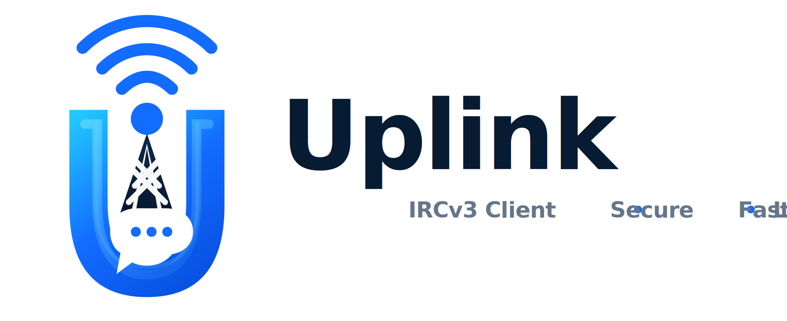
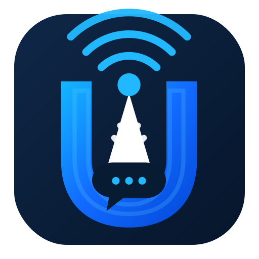
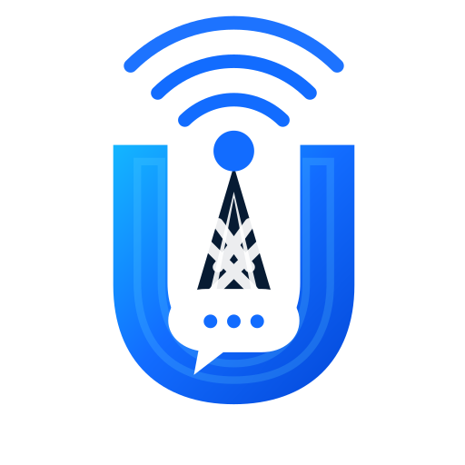
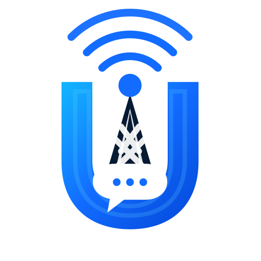
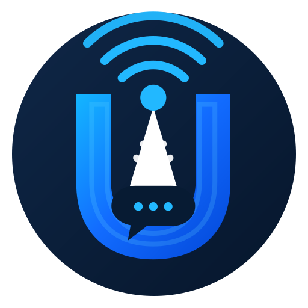
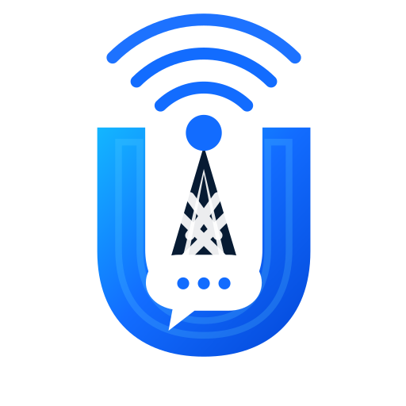
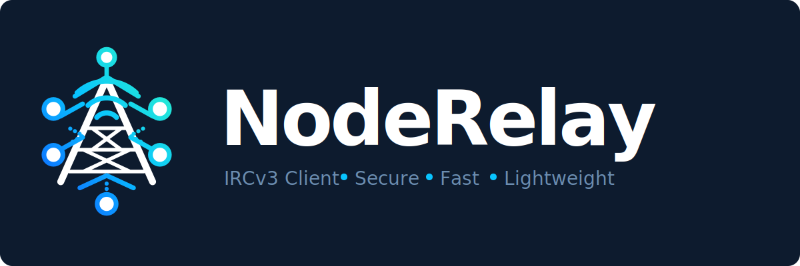

<p align="center">
  
</p>

<p align="center">
  <a href="https://github.com/joehonkey/UplinkIRC/releases/latest">
    
  </a>
  <a href="https://github.com/joehonkey/UplinkIRC/actions/workflows/ci.yml">
    
  </a>
  <a href="LICENSE">
    
  </a>
  
  
</p>

<p align="center">
  A fast, secure, IRCv3-featured IRC client built with Qt6 and C++17.<br/>
  Default network: <strong>irc.linuxdojo.org:6697</strong> &mdash; channel <strong>#uplink</strong>
</p>

---

<p align="center">
  <a href="https://github.com/joehonkey/UplinkIRC/releases/latest/download/UplinkIRC-v0.7.6-linux-x86_64.tar.gz">
    
  </a>
  &nbsp;
  <a href="https://github.com/joehonkey/UplinkIRC/releases/latest/download/UplinkIRC-v0.7.6-windows-x64.zip">
    
  </a>
  &nbsp;
  <a href="https://github.com/joehonkey/UplinkIRC/releases/latest/download/UplinkIRC-v0.7.6-macos-arm64.dmg">
    
  </a>
  &nbsp;
  <a href="#install-dependencies-first">
    
  </a>
</p>

<p align="center">
  
</p>

---

## App Icons

<p align="center">
  
  &nbsp;&nbsp;&nbsp;&nbsp;
  
  &nbsp;&nbsp;&nbsp;&nbsp;
  
  &nbsp;&nbsp;&nbsp;&nbsp;
  
  &nbsp;&nbsp;&nbsp;&nbsp;
  
</p>

<p align="center">
  <sub>Dark &nbsp;·&nbsp; Light Default &nbsp;·&nbsp; Light &nbsp;·&nbsp; Avatar &nbsp;·&nbsp; Mark</sub><br/>
  <sub>Switch at runtime: <strong>Hamburger → App Icon</strong></sub>
</p>

---

## Features

### 🔒 Security & Authentication

| Feature | Details |
|---|---|
| **TLS/SSL only** | All connections via `QSslSocket`. Plaintext IRC is not supported. |
| **SASL PLAIN** | Set `sasl_user` + `sasl_password` in config. Full CAP flow: `AUTHENTICATE`, `903`/`904`/`906`. |
| **NickServ auto-identify** | Set `nickserv_password` to send `IDENTIFY` on `RPL_WELCOME`. |

### 🌐 IRC Protocol & IRCv3

| Feature | Details |
|---|---|
| **CAP LS 302** | `multi-prefix`, `away-notify`, `server-time`, `message-tags`, `batch`, `chathistory`, `labeled-response`, `draft/typing`, `sasl` |
| **Chat history replay** | Requests the last 100 messages via `CHATHISTORY LATEST` on join. History messages display dimmed with original timestamps. |
| **Bouncer support** | First-class ZNC and soju: `znc.in/playback`, `soju.im/bouncer-networks`, `soju.im/read`, self-message echo. |
| **mIRC formatting** | Bold, italic, underline, strikethrough, reverse, 16 IRC colors (fg + bg). |
| **CTCP** | Auto-replies to `VERSION` and `PING`. Manual `/ctcp <target> <cmd>` for requests. |

### 🎨 Interface & Themes

| Feature | Details |
|---|---|
| **55 built-in themes** | Catppuccin, Dracula, Nord, Gruvbox, Tokyo Night, Solarized, One Dark, and many more. Switch live from **Hamburger → Theme**. |
| **Native Windows style** | On Windows, the `windows11` Qt style is used by default. No alien dark theme on fresh installs. Custom themes still available. |
| **Per-widget font sizes** | Independent size control for chat, sidebar, nick list, topic bar, input, and typing indicator. **Hamburger → Font Config...** |
| **QPainter menu icons** | Every hamburger menu item has its own monochrome line icon that adapts to light/dark themes. |
| **Panel persistence** | Dock sizes and positions saved on quit, restored on relaunch. |

### 💬 Chat Features

| Feature | Details |
|---|---|
| **Emoji picker** | Click 😊 to open a searchable grid of ~400 emoji. Enable with `show_emoji_button = true`. |
| **`:shortcode:` autocomplete** | Type `:fire` and a live completion list appears. Navigate with Up/Down, confirm with Enter. |
| **Emoji auto-substitute** | Typing `:trident:` replaces with 🔱 on the closing colon. Any remaining `:shortcode:` patterns resolve before the message is sent. |
| **Link preview cards** | URLs in messages auto-fetch `og:title` + `og:image`. A card with title, domain, and thumbnail appears inline. |
| **Typing indicator** | IRCv3 `draft/typing`. Shows `nick is typing…` as a transparent overlay on the chat background. Sends your own state debounced. |
| **mIRC colors** | Full IRC color codes rendered in chat. |
| **Tab completion** | Tab-completes nick names. Cycles through candidates. `: ` suffix at line start, ` ` suffix mid-line. |
| **Input history** | Up/Down arrows cycle through sent messages. |

### 🖥️ Nick List & Sidebar

| Feature | Details |
|---|---|
| **Bot indicators** | Nicks with `+B` mode display 🤖 or 👾 (randomly assigned per nick each session, stable across refreshes). |
| **Colored nicks** | Unique color per nick in both chat and the nick list. Toggle from hamburger. |
| **Prefix sorting** | Nick list sorted by prefix rank: `~ & @ % +` then alphabetical. |
| **Right-click menu** | Message, Whois, Give Op, Give Voice, Version on any nick. |
| **Unread dots** | `● #channel` in the sidebar when there are new messages. Clears on focus. |

### 🔌 Connectivity & Servers

| Feature | Details |
|---|---|
| **Manage Servers dialog** | Add, edit, remove servers at runtime. Changes take effect immediately, no config edit needed. |
| **Multiple servers** | Connect to as many servers as you want simultaneously. |
| **Auto-reconnect** | Exponential backoff: 5 s → 10 s → 20 s → 40 s → 60 s. Deliberate `/quit` disables it. |
| **Connection status** | Persistent bar showing `Connecting…` / `Connected…` / `Disconnected…`. |
| **System tray** | Minimizes to tray on close. Left-click shows window. Unread badge on mention. |

---

## Quick Start

```bash
git clone https://github.com/joehonkey/UplinkIRC.git
cd UplinkIRC
cmake -B build -DCMAKE_BUILD_TYPE=Release
cmake --build build
./build/UplinkIRC
```

The `themes/` folder is copied next to the binary by CMake automatically.

### Install dependencies first

<details>
<summary><strong>Arch Linux</strong></summary>

```bash
sudo pacman -S qt6-base qt6-svg cmake tomlplusplus
```
</details>

<details>
<summary><strong>Ubuntu / Debian</strong></summary>

```bash
sudo apt install cmake qt6-base-dev libqt6svg6-dev libtomlplusplus-dev
```
</details>

<details>
<summary><strong>Fedora</strong></summary>

```bash
sudo dnf install cmake qt6-qtbase-devel qt6-qtsvg-devel tomlplusplus-devel
```
</details>

<details>
<summary><strong>FreeBSD</strong></summary>

```bash
sudo pkg install cmake qt6-base qt6-svg tomlplusplus
```
</details>

<details>
<summary><strong>macOS (Homebrew)</strong></summary>

```bash
brew install cmake qt tomlplusplus
```
</details>

---

## Configuration

The config file is created automatically on first launch. You only need to fill in your nickname.

| Platform | Path |
|---|---|
| Linux / FreeBSD | `~/.config/LinuxDojo/UplinkIRC/config.toml` |
| macOS | `~/Library/Application Support/LinuxDojo/UplinkIRC/config.toml` |
| Windows | `%APPDATA%\LinuxDojo\UplinkIRC\config.toml` |

### Minimal example

```toml
[[server]]
host     = "irc.linuxdojo.org"
port     = 6697
ssl      = true
nick     = "yournick"
user     = "uplink"
realname = "UplinkIRC User"

[[server.channels]]
name = "#uplink"
```

### Full annotated example

```toml
# ── UI ──────────────────────────────────────────────────────────────────────
[ui]
# Theme name — must match a .toml file in themes/ (without the extension).
# Leave as "default" for the native OS look (recommended on Windows).
theme             = "catppuccin-mocha"

# Show your nick label in the input bar (e.g. "joehonkey ▸ ...")
show_nick_prefix  = true

# Drop the topic text below the info bar
show_topic        = true

# Show the 😊 emoji picker button next to the input box
# You can also always type :shortcode: to search emoji inline
show_emoji_button = true

# Unique color per nick in chat and nick list
colored_nicks     = true

# Send and receive IRCv3 draft/typing indicators
typing_indicator  = true

# Nick bracket style in chat messages
# "<>" = <nick>  "[]" = [nick]  "::::" = ::nick::  "" = nick (no brackets)
nick_brackets     = "<>"

# Show "Connected to / Disconnected from" in the status bar
show_conn_status  = true

# App icon variant: "dark" | "light" | "light-default" | "avatar"
app_icon          = "dark"

# Font family. On Windows defaults to "Consolas"; elsewhere "IBM Plex Mono".
font_family       = "IBM Plex Mono"

# Independent font sizes (pt) for every UI zone
font_sidebar      = 10
font_chat         = 10
font_nick_list    = 10
font_topic_bar    = 10
font_input_nick   = 10
font_input        = 10
font_typing       = 9

# ── Server ───────────────────────────────────────────────────────────────────
[[server]]
# Friendly display name shown in the sidebar header
name     = "LinuxDojo"
host     = "irc.linuxdojo.org"
port     = 6697
ssl      = true
nick     = "yournick"
user     = "uplink"
realname = "UplinkIRC User"

# SASL PLAIN — authenticate before appearing on the network
# sasl_user     = "yournick"
# sasl_password = "yourpassword"

# NickServ IDENTIFY sent automatically on connect (alternative to SASL)
# nickserv_password = "yourpassword"

# Bouncer mode: "znc" or "soju"
# bouncer         = "soju"
# bouncer_network = "libera"   # soju only: which network to attach to

# Auto-join channels
[[server.channels]]
name = "#uplink"

[[server.channels]]
name     = "#linux"
password = ""          # channel key if needed

# ── Second server (optional) ─────────────────────────────────────────────────
[[server]]
name = "Libera"
host = "irc.libera.chat"
port = 6697
ssl  = true
nick = "yournick"
user = "uplink"
realname = "UplinkIRC User"

[[server.channels]]
name = "#archlinux"
```

---

## Slash Commands

| Command | Description |
|---|---|
| `/join #channel [key]` | Join a channel |
| `/part [message]` | Leave the current channel |
| `/nick <newnick>` | Change your nickname |
| `/me <action>` | Send a CTCP ACTION (`* nick waves`) |
| `/msg <target> <text>` | Send a private message or open a PM tab |
| `/notice <target> <text>` | Send a NOTICE |
| `/topic [text]` | Show or set the channel topic |
| `/kick <nick> [reason]` | Kick a user (requires op) |
| `/away [message]` | Set away status |
| `/back` | Clear away status |
| `/whois <nick>` | Request WHOIS info |
| `/motd [server]` | Request the Message of the Day |
| `/version [nick]` | Request VERSION (nick optional) |
| `/ctcp <target> <cmd> [args]` | Send a CTCP request |
| `/sysinfo` | Post OS / CPU / GPU / RAM / uptime to channel |
| `/quote <raw>` | Send a raw IRC line |
| `/quit [message]` | Disconnect from the current server |
| `/help` | List all commands in the chat buffer |

### Emoji shortcuts

Type a colon to trigger inline autocomplete:

```
:fire       →  list: 🔥 fire, 🔥 ...
:trident:   →  auto-replaces to 🔱 on the closing colon
:joy: :100: →  resolved to 😂 💯 before sending
```

---

## Keyboard Shortcuts

| Shortcut | Action |
|---|---|
| `Enter` | Send message |
| `Tab` | Complete nick (cycles through candidates) |
| `↑` / `↓` | Scroll through input history |
| `↑` / `↓` (emoji popup) | Navigate emoji completion list |
| `Enter` / `Tab` (emoji popup) | Insert selected emoji |
| `Escape` (emoji popup) | Dismiss completion |

---

## Documentation

| Doc | Contents |
|---|---|
| [Configuration](docs/configuration.md) | Every config key with examples, bouncer setup, SASL |
| [Commands](docs/commands.md) | All slash commands + emoji shortcuts |
| [IRCv3 support](docs/ircv3.md) | Capability status and notes |
| [Keyboard shortcuts](docs/keyboard-shortcuts.md) | Full shortcut reference |
| [FAQ & Troubleshooting](docs/faq.md) | Common questions and fixes |

---

## Brand Assets

<p align="center">
  
</p>

The `assets/` directory contains all brand files for free use:

| File | Size | Description |
|---|---|---|
| `banner.svg` | 2200×900 | Wide banner — README header and About dialog |
| `logo.svg` | 1200×500 | Full logo with wordmark |
| `wordmark.svg` | 650×220 | Wordmark only |
| `icon-dark.svg` | 512×512 | App icon — dark variant |
| `icon-light-default.svg` | 512×512 | App icon — light default variant |
| `icon-light.svg` | 512×512 | App icon — light variant |
| `icon-avatar.svg` | 512×512 | GitHub avatar / circular icon |
| `icon-mark.svg` | 512×512 | Minimal mark |
| `icon-tray.svg` | 512×512 | System tray icon |

---

## License

MIT — see [LICENSE](LICENSE)
